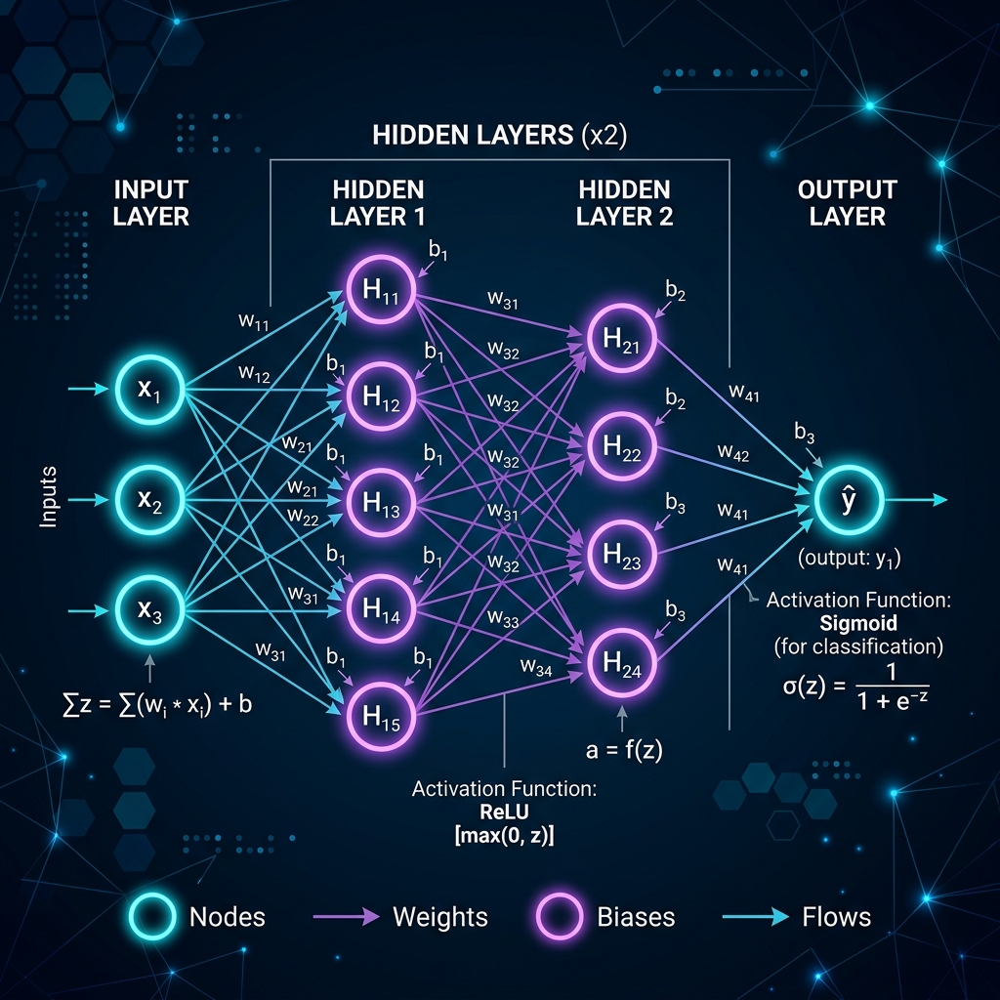
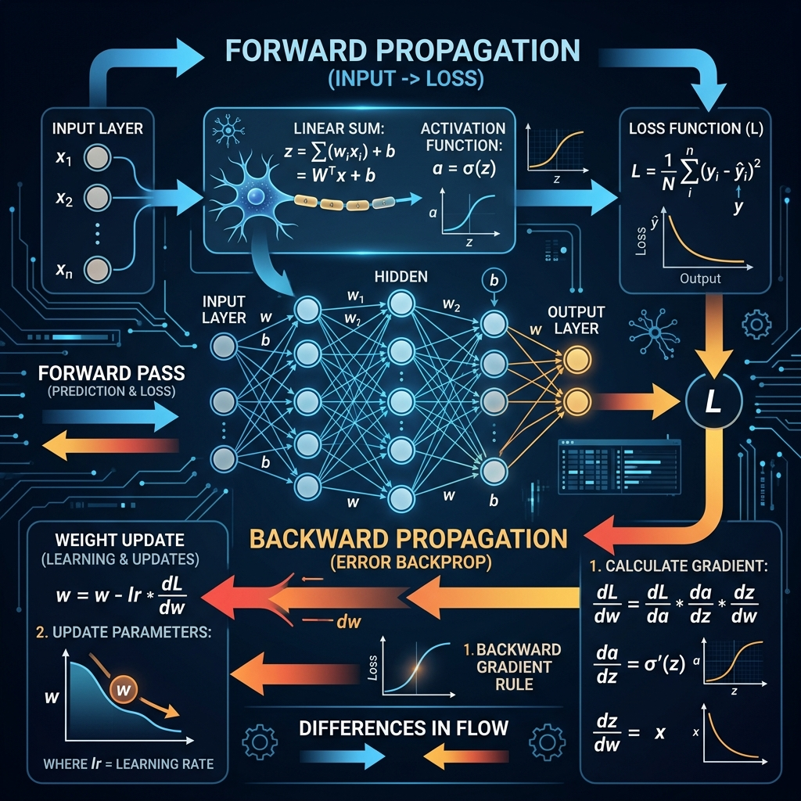
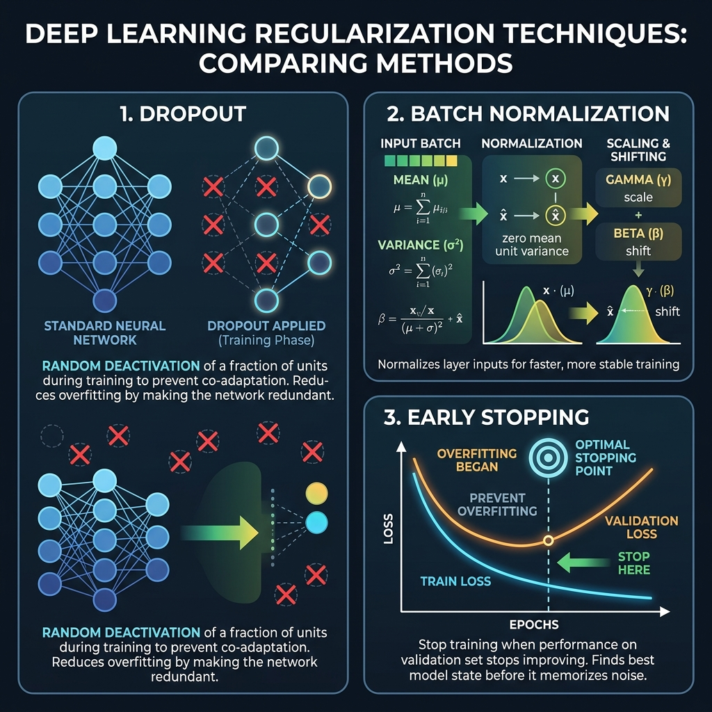
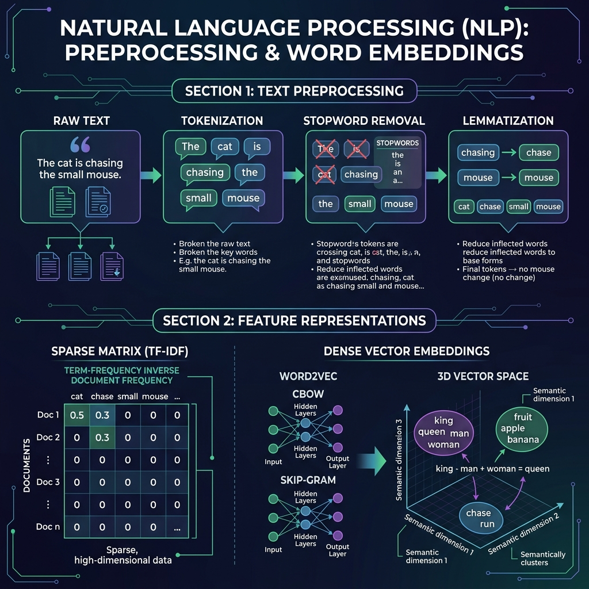

# 📙 Topic 04: Deep Learning – Introduction, ANN & Natural Language Processing (NLP)

Welcome to **Topic 04** of the AI Engineering curriculum! This module bridges classical machine learning with **Deep Learning** and introduces foundational **Natural Language Processing (NLP)**. You will master Artificial Neural Networks (ANN), the math behind forward and backward propagation, loss functions, regularization techniques (Dropout, Batch Normalization, Early Stopping), real-world industry case studies, and modern text representation techniques (TF-IDF, Word2Vec, Dense Embeddings).

---

## 📸 Architectural Overview

| Topic | Visual Diagram |
| :--- | :--- |
| **Artificial Neural Network Architecture** |  |
| **Forward & Backward Propagation** |  |
| **Deep Learning Regularization** |  |
| **NLP Preprocessing & Embeddings** |  |

---

## 🧠 Section 1: Fundamentals of Artificial Neural Networks (ANN)

### 1. Biological vs. Artificial Neurons

Artificial Neural Networks (ANNs) are computational models inspired by biological neural networks in human brains.

* **Biological Neuron**: Dendrites receive electrochemical signals, the Soma (cell body) processes them, and the Axon fires an output signal through Synapses to other neurons if an activation threshold is reached.
* **Artificial Neuron (Perceptron)**: Receives input values ($x_1, x_2, \dots, x_n$), multiplies each input by a trainable weight ($w_i$), adds a bias term ($b$), passes the weighted sum ($z$) through an **activation function** ($f$), and outputs an activation value ($a$).

$$\text{Weighted Sum } z = \sum_{i=1}^{n} w_i x_i + b = \mathbf{w}^T \mathbf{x} + b$$

$$\text{Activation Output } a = f(z)$$

---

### 2. Multi-Layer Perceptron (MLP) Architecture

A standard **Artificial Neural Network (ANN)** consists of multiple layers of interconnected neurons:


1. **Input Layer**: Receives raw feature vectors ($X$). The number of input neurons equals the number of feature dimensions.
2. **Hidden Layer(s)**: Intermediate layers that extract hierarchical features and non-linear patterns. Each hidden neuron computes $z^{[l]} = W^{[l]} a^{[l-1]} + b^{[l]}$ followed by non-linear activation $a^{[l]} = g(z^{[l]})$.
3. **Output Layer**: Produces final predictions ($\hat{y}$). For binary classification, 1 neuron with Sigmoid; for multi-class classification, $K$ neurons with Softmax; for regression, 1 continuous neuron (linear activation).

---

### 🏢 Real-World Industry Case Study: Credit Risk & Loan Default Prediction (FinTech)

> **Scenario**: A major digital bank (like Revolut or PayPal) needs to evaluate whether a new loan applicant will default ($y=1$) or repay ($y=0$).
> 
> * **Inputs ($X$)**: Credit score, annual income, debt-to-income ratio, employment length, recent inquiries.
> * **Why Linear Regression Fails**: The relationship between credit score and loan default is non-linear. High income with high debt is far riskier than medium income with zero debt.
> * **How ANN Solves It**: Hidden layers combine inputs to learn complex interactions (e.g., *Hidden Node 1* fires when `Debt/Income > 0.4` AND `Inquiries > 3`). The Sigmoid output layer provides a calibrated default probability percentage ($0.0 \text{ to } 1.0$).

---

### ✍️ Student Micro-Exercise 1: Single Neuron Calculation

**Task**: Calculate the output $a$ of a single neuron given the following parameters:
* **Inputs**: $x_1 = 2.0, \quad x_2 = -1.0, \quad x_3 = 3.0$
* **Weights**: $w_1 = 0.5, \quad w_2 = 1.2, \quad w_3 = -0.4$
* **Bias**: $b = 0.5$
* **Activation Function**: ReLU ($a = \max(0, z)$)

<details>
<summary><b>🔍 View Solution & Step-by-Step Explanation</b></summary>

1. **Compute Weighted Sum ($z$)**:
   $$z = (w_1 \cdot x_1) + (w_2 \cdot x_2) + (w_3 \cdot x_3) + b$$
   $$z = (0.5 \times 2.0) + (1.2 \times -1.0) + (-0.4 \times 3.0) + 0.5$$
   $$z = 1.0 - 1.2 - 1.2 + 0.5 = -0.9$$

2. **Apply ReLU Activation**:
   $$a = \max(0, -0.9) = 0.0$$

*Result*: The neuron remains inactive (outputs 0.0) because the weighted input was negative!
</details>

---

## 🔄 Section 2: Forward Propagation, Loss Functions & Backpropagation

### 1. Forward Propagation

Forward propagation is the process of passing input features forward through network layers to calculate predicted values $\hat{y}$.

$$\text{Layer 1: } z^{[1]} = W^{[1]} X + b^{[1]}, \quad a^{[1]} = \text{ReLU}(z^{[1]})$$

$$\text{Layer 2 (Output): } z^{[2]} = W^{[2]} a^{[1]} + b^{[2]}, \quad \hat{y} = \sigma(z^{[2]})$$

---

### 2. Loss Functions ($L$)

The loss function quantifies how far the predicted output $\hat{y}$ deviates from the ground-truth target $y$.

| Task Type | Loss Function | Mathematical Formula | Real-World Usage Example |
| :--- | :--- | :--- | :--- |
| **Regression** | Mean Squared Error (MSE) | $L = \frac{1}{N} \sum_{i=1}^{N} (y_i - \hat{y}_i)^2$ | Predicting Uber ride prices in dollars |
| **Regression** | Mean Absolute Error (MAE) | $L = \frac{1}{N} \sum_{i=1}^{N} \|y_i - \hat{y}_i\|$ | Predicting real estate house values (outlier robust) |
| **Binary Classification** | Binary Cross-Entropy | $L = -\frac{1}{N} \sum_{i=1}^{N} [y_i \log(\hat{y}_i) + (1 - y_i)\log(1 - \hat{y}_i)]$ | Spam vs. Non-Spam email detection |
| **Multi-Class Classification** | Categorical Cross-Entropy | $L = -\sum_{c=1}^{C} y_c \log(\hat{y}_c)$ | E-commerce product category tagging (Sports, Tech, Fashion) |

---

### 3. Backpropagation & The Chain Rule

**Backpropagation** is the foundational learning algorithm in Deep Learning. It computes partial derivatives of the loss function with respect to every weight ($W$) and bias ($b$) in the network using the **Chain Rule of Calculus**.


#### Step-by-Step Chain Rule Derivation (Output Layer to Hidden Layer):

1. **Error Gradient at Output**:
   $$\frac{\partial L}{\partial \hat{y}} = -\left( \frac{y}{\hat{y}} - \frac{1-y}{1-\hat{y}} \right)$$

2. **Derivative of Activation Function** (e.g., Sigmoid $\sigma(z)$):
   $$\frac{\partial \hat{y}}{\partial z^{[2]}} = \hat{y} (1 - \hat{y})$$

3. **Output Layer Weight Gradient**:
   $$\delta^{[2]} = \frac{\partial L}{\partial z^{[2]}} = \frac{\partial L}{\partial \hat{y}} \cdot \frac{\partial \hat{y}}{\partial z^{[2]}} = (\hat{y} - y)$$

   $$\frac{\partial L}{\partial W^{[2]}} = \delta^{[2]} \cdot (a^{[1]})^T, \quad \frac{\partial L}{\partial b^{[2]}} = \delta^{[2]}$$

4. **Propagating Gradient to Hidden Layer**:
   $$\delta^{[1]} = (W^{[2]})^T \delta^{[2]} \odot g'(z^{[1]})$$

   $$\frac{\partial L}{\partial W^{[1]}} = \delta^{[1]} \cdot X^T, \quad \frac{\partial L}{\partial b^{[1]}} = \delta^{[1]}$$

5. **Weight Parameter Update (Gradient Descent)**:
   $$W^{[l]} \leftarrow W^{[l]} - \eta \frac{\partial L}{\partial W^{[l]}}, \quad b^{[l]} \leftarrow b^{[l]} - \eta \frac{\partial L}{\partial b^{[l]}}$$
   *(where $\eta$ is the learning rate).*

---

### ✍️ Student Micro-Exercise 2: Gradient Update Calculation

**Task**: Given a current weight $w = 2.5$, learning rate $\eta = 0.1$, and loss gradient $\frac{\partial L}{\partial w} = 0.8$:
1. Calculate the updated weight $w_{\text{new}}$ after 1 step of Gradient Descent.
2. Does the weight increase or decrease? Why?

<details>
<summary><b>🔍 View Solution & Step-by-Step Explanation</b></summary>

1. **Gradient Descent Formula**:
   $$w_{\text{new}} = w - \eta \times \frac{\partial L}{\partial w}$$
   $$w_{\text{new}} = 2.5 - (0.1 \times 0.8) = 2.5 - 0.08 = 2.42$$

2. **Explanation**: The weight **decreases** because the positive gradient ($0.8$) indicates that increasing $w$ would increase loss. Moving in the negative gradient direction decreases the total loss!
</details>

---

## 🛡️ Section 3: Deep Learning Regularization & Optimization

Deep neural networks possess millions of parameters, making them prone to severe **overfitting** (memorizing training data noise). Regularization techniques stabilize training and improve generalization.


---

### 1. $L_1$ and $L_2$ Regularization (Weight Decay)

Adds a penalty term to the loss function based on the magnitude of weight matrices.

* **$L_2$ Regularization (Ridge / Weight Decay)**:
  $$L_{\text{total}} = L + \frac{\lambda}{2N} \sum ||W||^2$$
  *Drives weights closer to zero without making them exactly zero, preventing explosive weight values.*

* **$L_1$ Regularization (Lasso)**:
  $$L_{\text{total}} = L + \frac{\lambda}{N} \sum ||W||$$
  *Enforces sparsity by driving insignificant weights to exactly 0.*

---

### 2. Dropout

During each training step, **Dropout** randomly deactivates (sets to zero) a fraction $p$ of hidden neurons with probability $p$ (e.g., $p = 0.2$ or $0.5$).

* **Why it works**: Prevents complex co-adaptations between neurons. Forces the network to learn redundant, robust feature representations.
* **Inverted Dropout**: During training, activations are scaled by $\frac{1}{1-p}$ so no adjustment is needed during inference/testing.

---

### 3. Batch Normalization (BatchNorm)

**Batch Normalization** normalizes the activations of intermediate hidden layers across a mini-batch during training.

#### BatchNorm Mathematical Steps:
1. **Mini-Batch Mean**:
   $$\mu_B = \frac{1}{m} \sum_{i=1}^{m} x_i$$
2. **Mini-Batch Variance**:
   $$\sigma_B^2 = \frac{1}{m} \sum_{i=1}^{m} (x_i - \mu_B)^2$$
3. **Normalize Activation**:
   $$\hat{x}_i = \frac{x_i - \mu_B}{\sqrt{\sigma_B^2 + \epsilon}}$$
4. **Scale and Shift (Learnable Parameters $\gamma, \beta$)**:
   $$y_i = \gamma \hat{x}_i + \beta$$

#### Key Benefits:
* Solves **Internal Covariate Shift** (shifting distribution of layer inputs).
* Enables higher learning rates and faster convergence.
* Acts as a mild regularizer.

---

### 4. Early Stopping

**Early Stopping** monitors performance on a separate validation dataset during training. Training halts when the validation loss stops decreasing and begins to increase (indicating overfitting). The model restores weights from the epoch with the lowest validation loss.

---

### 🏢 Real-World Industry Case Study: Medical Image & Diagnostics Overfitting Prevention (Healthcare)

> **Scenario**: A diagnostic health company trains an ANN to classify tumor risk from 2,000 MRI scans.
> 
> * **The Danger**: Without regularization, deep networks memorize background scanner noise, hospital logo watermarks, or patient age artifacts, achieving 99% train accuracy but failing on real patients.
> * **The Regularization Strategy**:
>   1. **BatchNorm**: Normalizes intensity variations between different hospital MRI scanners.
>   2. **Dropout ($p=0.4$)**: Randomly drops neurons so the model cannot rely on any single feature pixel.
>   3. **Early Stopping**: Halts training at Epoch 25 when validation loss hits minimum before the model starts memorizing noise.

---

### ✍️ Student Micro-Exercise 3: Spot the Overfitting Epoch

**Task**: Examine the training logs of an ANN below. At which epoch should **Early Stopping** trigger?

| Epoch | Training Loss | Validation Loss | Validation Accuracy |
| :---: | :---: | :---: | :---: |
| **1** | 0.850 | 0.820 | 62.0% |
| **5** | 0.420 | 0.450 | 81.5% |
| **10** | 0.210 | 0.280 | 89.0% |
| **15** | **0.110** | **0.250** | **91.5%** |
| **20** | 0.050 | 0.310 | 90.0% |
| **25** | 0.015 | 0.420 | 88.5% |

<details>
<summary><b>🔍 View Solution & Explanation</b></summary>

**Optimal Stopping Point**: **Epoch 15**.
* At Epoch 15, Validation Loss hits its lowest point (**0.250**) and Validation Accuracy hits its peak (**91.5%**).
* After Epoch 15, Training Loss continues falling ($0.110 \rightarrow 0.015$), but Validation Loss rises ($0.250 \rightarrow 0.420$), indicating clear **overfitting**.
</details>

---

## 🔤 Section 4: Natural Language Processing (NLP) Preprocessing & Features

Natural Language Processing enables computers to understand, interpret, and generate human language. Because machine learning models require numerical matrices, raw text must undergo **Preprocessing** and **Vectorization**.


---

### 1. Text Preprocessing Pipeline

Raw textual data is noisy and unstructured. Preprocessing standardizes the text:

1. **Lowercasing**: Converting all text to lowercase to treat `"Machine"` and `"machine"` identically.
2. **Noise & Punctuation Removal**: Stripping HTML tags, URLs, special symbols, and numbers using Regular Expressions (Regex).
3. **Tokenization**: Breaking raw text strings into discrete tokens (words, subwords, or characters).
4. **Stopwords Removal**: Filtering out non-informative words (`"is"`, `"the"`, `"at"`, `"which"`).
5. **Stemming vs. Lemmatization**:
   * **Stemming**: Rule-based algorithm that chops off word affixes to leave a root stem (e.g., `"running"`, `"runs"` $\rightarrow$ `"run"`, `"studies"` $\rightarrow$ `"studi"`). Fast but can produce non-words.
   * **Lemmatization**: Morphological analysis using vocabulary/dictionary lookup to find the true dictionary lemma (e.g., `"better"` $\rightarrow$ `"good"`, `"studies"` $\rightarrow$ `"study"`).

---

### 2. Traditional Feature Representations: TF-IDF & Bag-of-Words

#### Bag-of-Words (BoW)
Represents a document by word frequency counts, ignoring word order and grammar.

#### Term Frequency-Inverse Document Frequency (TF-IDF)
TF-IDF measures how important a term $t$ is to a document $d$ relative to an entire corpus $D$.

$$\text{TF}(t, d) = \frac{\text{Count of term } t \text{ in document } d}{\text{Total terms in document } d}$$

$$\text{IDF}(t, D) = \log \left( \frac{N}{|\{d \in D : t \in d\}|} \right)$$

$$\text{TF-IDF}(t, d, D) = \text{TF}(t, d) \times \text{IDF}(t, D)$$

* **High TF-IDF Score**: Terms that appear frequently in a specific document but rarely across other documents (e.g., `"hyperparameter"` in an ML paper).
* **Low TF-IDF Score**: Common terms appearing in almost all documents.

---

### 3. Dense Embeddings & Word2Vec

While TF-IDF creates high-dimensional, **sparse** vectors with zero semantic relationship between words (e.g., `"king"` and `"queen"` are orthogonal vectors), **Word Embeddings** map words into dense $d$-dimensional continuous vector spaces ($d \in [50, 300]$) where semantically similar words are close together.

#### Word2Vec Architectures:
Developed by Mikolov et al. at Google (2013):

1. **CBOW (Continuous Bag-of-Words)**: Predicts the target word given context words (e.g., Context: `["the", "cat", "on", "mat"]` $\rightarrow$ Target: `"sat"`).
2. **Skip-Gram**: Predicts context words given a single target word (e.g., Target: `"sat"` $\rightarrow$ Context: `["the", "cat", "on", "mat"]`).

#### Vector Arithmetic in Embedding Space:
$$\mathbf{v}_{\text{king}} - \mathbf{v}_{\text{man}} + \mathbf{v}_{\text{woman}} \approx \mathbf{v}_{\text{queen}}$$

---

### 🏢 Real-World Industry Case Study: Customer Support Ticket Auto-Routing (Zendesk / Uber)

> **Scenario**: Zendesk processes over 1,000,000 incoming support tickets per day.
> 
> * **Challenge**: Manual triage takes hours. A ticket reading *"Payment failed on credit card during checkout"* must reach Billing, while *"App crashed after updating to iOS 18"* must reach Tech Support.
> * **The Solution**: 
>   1. Preprocess raw ticket body (lowercase, clean HTML tags, lemmatize).
>   2. Convert tokenized tickets into 300-dimensional **Word2Vec embeddings** or **TF-IDF matrices**.
>   3. Feed vectors into an **ANN text classifier** that predicts ticket intent with 95%+ accuracy in under 10 milliseconds.

---

### ✍️ Student Micro-Exercise 4: TF-IDF Calculation

**Task**: Consider a mini corpus of $N = 100$ total documents:
* Document 1 contains 10 words. The word `"refund"` appears **3 times** in Document 1.
* The word `"refund"` appears in **5 documents** out of 100 total documents.

Compute the **TF-IDF score** for `"refund"` in Document 1 using $\text{IDF} = \log_{10}(N / \text{DF})$.

<details>
<summary><b>🔍 View Solution & Calculation Steps</b></summary>

1. **Calculate Term Frequency (TF)**:
   $$\text{TF} = \frac{3}{10} = 0.3$$

2. **Calculate Inverse Document Frequency (IDF)**:
   $$\text{IDF} = \log_{10}\left(\frac{100}{5}\right) = \log_{10}(20) \approx 1.301$$

3. **Calculate TF-IDF**:
   $$\text{TF-IDF} = \text{TF} \times \text{IDF} = 0.3 \times 1.301 \approx 0.3903$$
</details>

---

## 📊 Section 5: Text Classification Pipeline

Text classification assigns predefined categories to unstructured text documents (e.g., Sentiment Analysis, Spam Detection, Topic Tagging).

### Standard Text Classification Flow:
1. **Raw Text Input** $\rightarrow$ Clean & Preprocess (Tokenize, Lemmatize).
2. **Feature Extraction** $\rightarrow$ Convert tokens to TF-IDF matrix or Word2Vec Embeddings.
3. **Model Classifier** $\rightarrow$ Train Logistic Regression, Random Forest, or ANN.
4. **Evaluation** $\rightarrow$ Measure Accuracy, Precision, Recall, F1-Score, and Confusion Matrix.

---

## 💻 Section 6: Practical Code Examples & Guided Exercises

### Example 1: Building an ANN with PyTorch (Dropout, BatchNorm, Early Stopping)

```python
import torch
import torch.nn as nn
import torch.optim as optim

# 1. Define ANN Architecture with Regularization
class RegularizedANN(nn.Module):
    def __init__(self, input_dim, num_classes):
        super(RegularizedANN, self).__init__()
        self.network = nn.Sequential(
            nn.Linear(input_dim, 128),
            nn.BatchNorm1d(128),          # Batch Normalization
            nn.ReLU(),
            nn.Dropout(0.3),              # Dropout (30%)
            
            nn.Linear(128, 64),
            nn.BatchNorm1d(64),
            nn.ReLU(),
            nn.Dropout(0.2),              # Dropout (20%)
            
            nn.Linear(64, num_classes)
        )

    def forward(self, x):
        return self.network(x)

# Instantiate Model
model = RegularizedANN(input_dim=500, num_classes=2)
criterion = nn.CrossEntropyLoss()
optimizer = optim.Adam(model.parameters(), lr=0.001, weight_decay=1e-4) # L2 Regularization
print(model)
```

---

### Example 2: NLP Preprocessing, TF-IDF & Text Classification with Scikit-Learn

```python
import re
import nltk
from nltk.corpus import stopwords
from nltk.stem import WordNetLemmatizer
from sklearn.feature_extraction.text import TfidfVectorizer
from sklearn.model_selection import train_test_split
from sklearn.linear_model import LogisticRegression
from sklearn.metrics import classification_report

nltk.download('stopwords')
nltk.download('wordnet')

# Sample Dataset
corpus = [
    "The neural network model trained with GPU acceleration yields outstanding accuracy!",
    "Poor customer service and delayed shipping made this purchase frustrating.",
    "Deep learning algorithms require properly normalized datasets and tuning.",
    "Terrible product quality. Failed to work within two days of arrival."
]
labels = [1, 0, 1, 0] # 1: Positive/Tech, 0: Negative

# 1. Text Preprocessing Function
lemmatizer = WordNetLemmatizer()
stop_words = set(stopwords.words('english'))

def clean_text(text):
    text = text.lower()                                    # Lowercase
    text = re.sub(r'[^a-zA-Z\s]', '', text)               # Remove special chars/punctuation
    tokens = text.split()
    tokens = [lemmatizer.lemmatize(w) for w in tokens if w not in stop_words] # Lemmatize & filter
    return " ".join(tokens)

cleaned_corpus = [clean_text(doc) for doc in corpus]

# 2. TF-IDF Vectorization
vectorizer = TfidfVectorizer(max_features=100)
X_tfidf = vectorizer.fit_transform(cleaned_corpus).toarray()

# 3. Model Training
clf = LogisticRegression()
clf.fit(X_tfidf, labels)
preds = clf.predict(X_tfidf)

print("Classification Report:\n", classification_report(labels, preds))
```

---

### Example 3: Word2Vec Embeddings with Gensim

```python
from gensim.models import Word2Vec

# Preprocessed tokenized sentences
tokenized_sentences = [
    ["deep", "learning", "neural", "network", "backpropagation"],
    ["natural", "language", "processing", "text", "embeddings"],
    ["word2vec", "cbow", "skipgram", "dense", "vector"],
    ["neural", "network", "optimization", "dropout", "batchnorm"]
]

# Train Word2Vec Model (Skip-Gram)
w2v_model = Word2Vec(sentences=tokenized_sentences, vector_size=50, window=3, min_count=1, sg=1)

# Find vector for word and most similar words
print("Vector for 'neural':\n", w2v_model.wv['neural'][:5]) # print first 5 dims
print("\nWords most similar to 'network':")
for word, similarity in w2v_model.wv.most_similar('network', topn=3):
    print(f" - {word}: {similarity:.4f}")
```

---

## 🎯 Multi-Tier Student Exercises & Assignment

To ensure complete understanding, choose and complete the practical exercises below:

### 🟢 Level 1: Beginner Hands-On Practice
1. **Neuron Math**: Write a short Python function `perceptron_forward(X, W, b, activation)` that computes forward pass output for any arbitrary input list `X`, weights `W`, bias `b`, and choice of activation (`'relu'` or `'sigmoid'`).
2. **Preprocessing Challenge**: Write a regex expression in Python to strip all HTML tags (e.g. `<p>Hello <b>World</b></p>` $\rightarrow$ `"Hello World"`).

---

### 🟡 Level 2: Intermediate Hands-On Practice
1. **Stemming vs Lemmatization Comparison**: Run `PorterStemmer` and `WordNetLemmatizer` on the following word list: `["running", "caring", "easily", "fairly", "matrices", "geese"]`. Create a comparison table printing the raw word, stem, and lemma side-by-side.
2. **Word2Vec Similarity Exploration**: Train a Word2Vec model on a short custom text paragraph. Calculate the Cosine Similarity score between 3 pairs of words (e.g., `(good, great)`, `(good, bad)`, `(apple, computer)`).

---

### 🔴 Level 3: Advanced Capstone Assignment

#### Task Title: *"The Customer Review Sentiment & Intent Intelligence Engine"*

#### Objective
Build an end-to-end Deep Learning and Natural Language Processing pipeline that cleans raw unstructured customer reviews, extracts numerical representations (TF-IDF vs. Word2Vec embeddings), trains an Artificial Neural Network (ANN) with regularization, and evaluates classification performance.

#### Dataset Requirement
Use the **IMDB Movie Reviews Dataset** or **Amazon Product Reviews Dataset** (or generate a synthetic dataset with at least 1,000 text reviews across binary or multi-class sentiment categories).

---

### 📋 Assignment Tasks & Deliverables

#### Part 1: Text Preprocessing & TF-IDF Vectorization
1. Implement a complete custom text cleaning function performing lowercasing, regex punctuation removal, stopword filtering, and Lemmatization.
2. Generate a **TF-IDF matrix** with `max_features=1000` and analyze top 10 highest TF-IDF features across positive vs. negative reviews.

#### Part 2: Dense Word Embeddings (Word2Vec)
1. Train a **Word2Vec** model (Continuous Bag-of-Words or Skip-Gram) on the tokenized review corpus using `gensim`.
2. Compute average document vectors by averaging the Word2Vec embeddings of all tokens in a review.
3. Compute Cosine Similarity between key domain terms (e.g., `"excellent"` vs `"outstanding"` and `"bad"` vs `"terrible"`).

#### Part 3: Deep Neural Network (ANN) Construction & Training
1. Build a PyTorch or TensorFlow/Keras Artificial Neural Network with:
   * Input layer matching embedding/TF-IDF dimension.
   * At least 2 hidden layers.
   * **Batch Normalization** applied after each hidden dense layer.
   * **Dropout** ($p=0.3$) applied before activation.
   * Output layer with Sigmoid/Softmax activation.
2. Train the model using **Adam Optimizer**, **Binary Cross-Entropy Loss**, and implement **Early Stopping** with a patience of 5 epochs monitoring validation loss.

#### Part 4: Evaluation & Comparative Report
1. Compare the classification performance of **TF-IDF + ANN** versus **Word2Vec + ANN**.
2. Plot Training vs. Validation Loss curves to demonstrate that Dropout & Early Stopping successfully prevented overfitting.
3. Output the final Confusion Matrix, Precision, Recall, and F1-Score.

---

### 📂 Submission Instructions for Students
* Students should save their completed Jupyter Notebooks (`.ipynb`) or Python scripts inside their assigned directory:
  `students/<student_name>/Topic_04_DL_ANN_NLP/`
